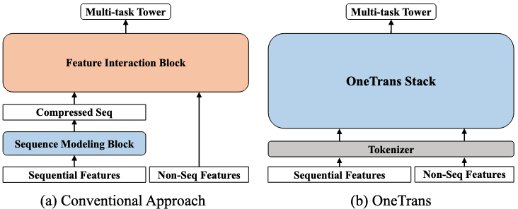

# OneTrans: Unified Feature Interaction and Sequence Modeling with One Transformer in Industrial Recommender

字节跳动，2025.10

http://arxiv.org/abs/2510.26104

## TL;DR

使用一个transformer模块统一建模非序列特征（特征交叉）和序列特征（序列建模），使得两种特征可以更好地交互，并且借助LLM的各种优化手段（kv cache、flash attention、混合精度训练、激活值重计算等）减少推理延迟。

## Motivation

传统架构是一个 `encode-then-interaction` 的范式，首先对序列特征编码，然后和非序列特征融合后再做特征交叉。这种架构会产生两种问题：

1. 限制了序列特征和非序列特征之间的双向信息交互，从而弱化了上下文特征（非序列）对序列表征的影响；
2. 级联架构会产生计算碎片。若使用统一的Transformer类backbone可以复用各种优化手段来更好地scaling。

## Methodology

### Overall Architecture

首先用tokenizer将序列特征变为S-tokens、非序列特征变为NS-tokens。
