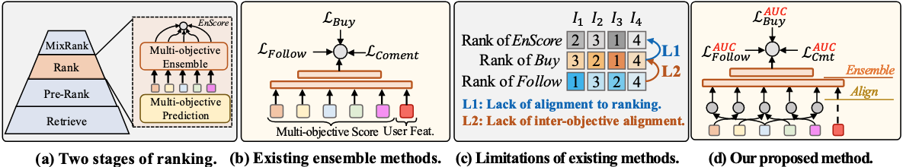
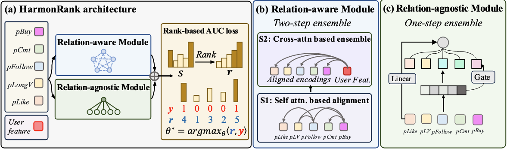

# HarmonRank: Ranking-aligned Multi-objective Ensemble for Live-streaming E-commerce Recommendation

快手，2026.01

http://arxiv.org/abs/2601.02955

## TL;DR

两个层级的对齐：与 AUC 指标对齐、多目标之间相互对齐

1. 与 AUC 指标对齐的端到端排序优化：将不可微的 AUC 建模为 rank-sum 问题，并利用可微分排序 (differentiable ranking) 直接端到端地优化多目标 AUC 总和，不需要使用间接的分类或回归的代理损失。
2. 两阶段多目标集成范式：将原有的单步集成范式改进为两阶段的 `Align-and-Emsemble` 的新范式，显式建模不同目标（购买、评论、关注等）之间的共享排序能力。

## 1. Motivation

在精排阶段需要利用多目标预测对多个指标（如购买、评论、关注）分别进行预测，各自得到一个分数之后再通过集成模型最终输出一个精排分数。这个集成模型一般通过同时优化每一个指标的二分类交叉熵来训练:

$$
\begin{equation}
    \mathcal{L}=\mathcal{L}_{CE}(y_{buy},\hat{y}_{buy}) + \mathcal{L}_{CE}(y_{follow},\hat{y}_{follow}) + \mathcal{L}_{CE}(y_{comment},\hat{y}_{comment})
\end{equation}
$$

这种范式存在两种显著缺陷：

1. 二分类任务的优化方向和排序任务的目标（即 AUC 指标）不一致。
2. 忽略了各个目标之间的对齐关系，如：评论和购买行为往往存在一定相关性。

## 2. Methodology

### 2.1. AUC 对齐

我们已有一个离线数据集 $\mathcal{D}=\{(x_i,y_i)\}_{i=1}^N$。对于第 $i$ 个样本，我们通过预估模型和集成模型得到一个精排分数 $s_i\in[0,1]$，则 AUC 的定义如下：

$$
\begin{equation}
    \begin{aligned}
        \mathcal{G}_m(\mathcal{D})&=\frac{\sum_{s_i\in\mathcal{D}_m^+,s_j\in\mathcal{D}_m^-}\mathbb{I}(s_i\ge s_j)}{|\mathcal{D}_m^+|\cdot |\mathcal{D}_m^-|}\\
        \mathcal{G}(\mathcal{D})&=\frac{1}{M}\sum_{m=1}^M\mathcal{G}_m(\mathcal{D})
    \end{aligned}
\end{equation}
$$

其中 $\mathcal{D}_m^+$ 表示关于行为 $m$ 的正样本，$\mathcal{D}_m^-$ 表示负样本。

由于上式不可微，因此不能直接优化。现有的 AUC 优化方法一般都是寻找一个可微的函数来替代指示函数 $\mathbb{I}(s_i\ge s_j)$ 来将 AUC 作为训练目标。

AUC 也可以用下面的 rank-sum 方式来计算（经典八股）：

$$
\begin{equation}
    \mathcal{G}(w)=\frac{\langle r,y\rangle - |\mathcal{D}^+|(|\mathcal{D}^+|+1)/2}{|\mathcal{D}^+|\cdot |\mathcal{D}^-|}
\end{equation}
$$

其中，$r=\text{Rank}(s)$ 表示按照精排分数对所有 candidates 降序排序后，每个样本的排名。

> 例：假设有5个样本（正负样本都有），其精排分数为 s=[0.7,0.2,0.8,0.1,0.9]，则 r=[3,4,2,5,1]。

因此，我们只需要最大化 $\langle r,y\rangle$ 项即可。

这里问题在于 $\text{Rank}(\cdot)$ 依然是不可微的，因此作者提出使用可微分排序算法来优化。

原始的排序问题可以表示为在一个所有可行排列的集合 $\Sigma$ 上寻找一个排列 $\sigma$，使得目标函数 $\langle s,r_{\sigma}\rangle$ 最大化：

$$
\begin{equation}
    r^*=\arg\max_{\sigma\in\Sigma}\langle s,r_{\sigma}\rangle
\end{equation}
$$

作者通过引入了集合 $\Sigma$ 的凸包 (convex hull)，即置换多面体 (permutahedron) 来将上述的离散优化问题变得可微：

$$
\begin{equation}
    \mathcal{P}(r):=\text{conv}\{ r_\sigma\mid\sigma\in\Sigma \}
\end{equation}
$$

为了将问题转化为连续可微的优化问题，作者引入了一个二次正则化项，至此就可以把损失函数写成 MSE 的形式：

$$
\begin{equation}
    \begin{aligned}
        P(s,r)
        &=\arg\max_{t\in\mathcal{P}(r)}\langle s,t\rangle-\frac{1}{2}\|t\|^2\\
        &=\arg\min_{t\in\mathcal{P}(r)}\|t-s\|^2
    \end{aligned}
\end{equation}
$$

### 2.2. 优化目标对齐

为了在不同的优化目标内部进行对齐，作者设计了两个通道分别对多目标分数进行融分：

1. Relation-aware Module：两步融分 `align-then-ensemble`。第一步使用 self-attention 捕捉不同目标之间的关系，再使用 cross-attention 将各种分数融合到 user profile 表征上。
2. Relation-agnostic Module：一步融分。使用一个 gating 模块来学习每个分数的权重。

最终的精排分数就是两个模块的输出分数之和。

