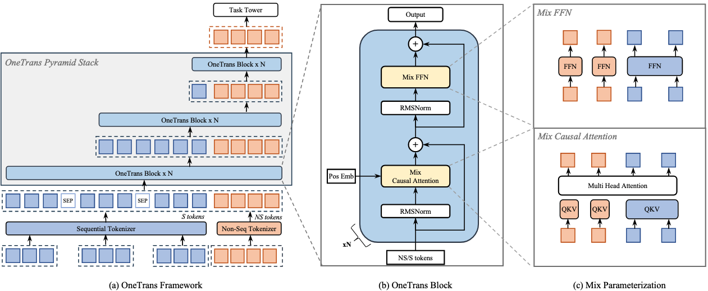
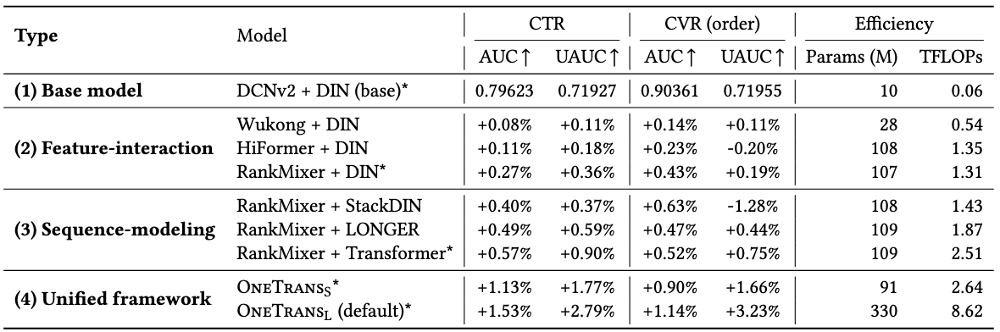
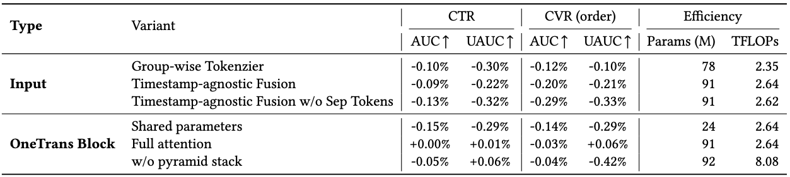

# OneTrans: Unified Feature Interaction and Sequence Modeling with One Transformer in Industrial Recommender

字节跳动，2025.10

http://arxiv.org/abs/2510.26104

## TL;DR

使用一个 Transformer 模块统一建模非序列特征（特征交叉）和序列特征（序列建模），使得两种特征可以更好地交互，并且借助 LLM 的各种优化手段（kv cache、flash attention、混合精度训练、激活值重计算等）减少推理延迟。

## 1. Motivation

传统架构是一个 `encode-then-interaction` 的范式，首先对序列特征编码，然后和非序列特征融合后再做特征交叉。这种架构会产生两种问题：

1. 限制了序列特征和非序列特征之间的双向信息交互，从而弱化了上下文特征（非序列）对序列表征的影响；
2. 级联架构会产生计算碎片。若使用统一的 Transformer 类 backbone 可以复用各种优化手段来更好地 scaling。

## 2. Methodology

### 2.1. Tokenizer

首先用 tokenizer 将序列特征变为 S-tokens、非序列特征变为 NS-tokens。

作者提出两种方式划分非序列特征：

1. Group-wise Tokenizer：所有 NS 特征先按照语义分组（context / user / doc 等），然后分别经过 MLP 映射到相同的维度。
2. Auto-Split Tokenizer：所有 NS 特征先过同一个 MLP 再划分到不同 token，这种方式可以减少计算开销。

对于序列特征，作者先将用户的不同行为序列各自拼接 side information 之后，各自通过一个 MLP 映射到相同的维度。然后需要把各种行为序列合并起来，作者提出了两种合并方式：

1. Timestamp-aware：按照序列中 item 的交互时间先后合并，每个 item 上要引入行为类型的特征。
2. Timestamp-agnostic：按照不同行为的重要度直接合并多条序列。

实验发现 Auto-Split + Timestamp-aware 的效果最好。

### 2.2. OneTrans Block

将分词之后的 S-tokens 和 NS-tokens 经过一个金字塔形状的 OneTrans Block，其中堆叠了多个 MixedMHA 和 MixedFFN 层：

- 这里之所以叫 Mixed 是因为不同 token 的可训练参数量是不同的，所有 S-tokens 共享 qkv 参数，不同 NS-token 则具有不同的 qkv 参数。
- 不同层的 OneTrans Block 之间呈现出金字塔结构，每一层的 S-token 数逐渐减小（通过减少 query 的数量），到最后全部消失，仅保留 NS-token，也就是 NS-token 最终拥有全部特征的信息。

### 2.3. Training and Deployment Optimization

#### 2.3.1. 跨请求的 kv caching

对于同一个 user 的请求，其 S-tokens 对于不同的 candidate items 来说是相同的，但 NS-tokens 则不同。借由这种架构，作者提出了两阶段 kv caching 的技术：

1. 阶段一（S 侧，一个请求只做一次）：计算并缓存所有 S-tokens 的 key-value pair 以及 attention 的输出
2. 阶段二（NS 侧，每个 candidate 做一次）：将每个 candidate 的 NS-tokens 与阶段一中缓存的 key-value pair 进行 cross attention。

#### 2.3.2. 训练优化策略

使用 FlashAttention-2 减少IO次数，使用混合精度训练 (BF16 / FP16) 以及激活值重计算的技术。

## 3. Experiments

### 3.1. Setups

两种不同参数量的 OneTrans 模型：

1. OneTrans-S：6层 OneTrans Block，d=256，H=4，参数量 91M。
2. OneTrans-L：8层 OneTrans Block，d=384，H=4，参数量 330M。

优化器：
1. 稀疏 embedding 参数：AdaGrad，$\beta_1=0.1$，$\beta_2=1.0$。
2. 稠密参数：RMSPropV2，lr=5e-3，momentum=0.99999。

> 优化器设置这里有点奇怪。首先我似乎没查到 RMSPropV2 是个什么优化器，作者也没有给 citation。其次AdaGrad 为什么会有 $\beta_1$ 和 $\beta_2$ 呢？这不是 Adam 的参数吗？最后作者也没有给出为什么要使用两种优化器的解释，也没看到有实验验证。

### 3.2. 对比实验

### 3.3. 消融实验

